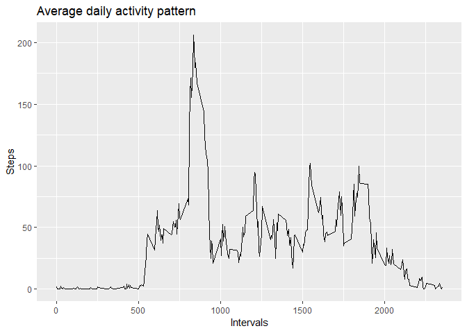
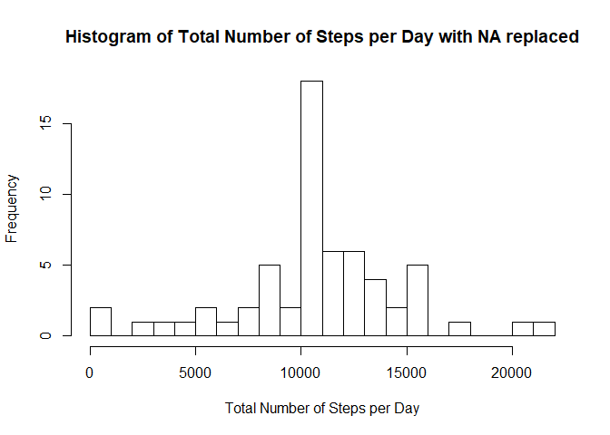
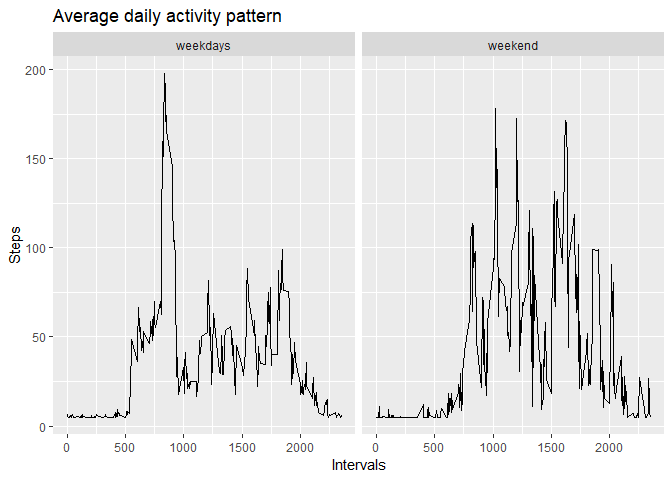

Project 1
=========

**Loading and preprocessing the data**

    data<-read.csv("activity.csv" )
    head(data)

    ##   steps       date interval
    ## 1    NA 2012-10-01        0
    ## 2    NA 2012-10-01        5
    ## 3    NA 2012-10-01       10
    ## 4    NA 2012-10-01       15
    ## 5    NA 2012-10-01       20
    ## 6    NA 2012-10-01       25

**What is mean total number of steps taken per day and the median?**

*-Calculate and report the mean and median total number of steps taken
per day*

    library(dplyr)
    newdata <- na.omit(data)
    bydays<-list(newdata$date)
    sumsbyday<-aggregate(newdata[c("steps")], by=bydays,sum)
    colnames(sumsbyday)[colnames(sumsbyday) == 'Group.1'] <- 'Date'
    colnames(sumsbyday)[colnames(sumsbyday) == 'steps'] <- 'Total_Steps'
    mean(sumsbyday$Total_Steps)

    ## [1] 10766.19

    median((sumsbyday$Total_Steps))

    ## [1] 10765

*-Make a histogram of the total number of steps taken each day*

    hist(x = sumsbyday$Total_Steps,breaks=30,xlab = "Total Number of Steps per Day", main = "Histogram of Total Number of Steps per Day")

instructions_fig/Figure1.png

**What is the average daily activity pattern?**

*-which 5-minute interval, on average across all the days in the
dataset, contains the maximum number of steps?*

    intervals<-aggregate(steps ~ interval, data=data, mean)
    intervalMax<-subset(intervals,intervals$steps==(max(intervals$steps)))
    maxi<-intervalMax[1,1]
    maxi2<-intervalMax[1,2]

The max 5-minutes interval is 835 and its values is 206.1698113

*-Make a time series plot (i.e. type = “l”) of the 5-minute interval
(x-axis) and the average number of steps taken, averaged across all days
(y-axis)*

    library(ggplot2)
    library(dplyr)
     ggplot(intervals, aes(x=interval, y=steps)) +
         geom_line() + 
         labs(x = "Intervals", y = "Steps",title ="Average daily activity pattern")

**Imputing missing values**

*-Calculate and report the total number of missing values in the dataset
(i.e. the total number of rows with NAs)*

    missingvalues<-sum(is.na(data))
    missingvalues

    ## [1] 2304

    colSums(is.na(data))

    ##    steps     date interval 
    ##     2304        0        0

    mean(data$steps, na.rm = T)

    ## [1] 37.3826

*-Create a new dataset that is equal to the original dataset but with
the missing data filled in.*

    dataimpute <- data
    dataimpute$steps[is.na(dataimpute$steps)] <- mean(dataimpute$steps, na.rm = T)
    colSums(is.na(dataimpute))

    ##    steps     date interval 
    ##        0        0        0

    dataimpute$date<-as.Date(dataimpute$date)
    sumsbyday2<-aggregate(steps~date, data=dataimpute,sum)
    colnames(sumsbyday2)[colnames(sumsbyday2) == 'steps'] <- 'Total_Steps'
    head(sumsbyday2)

    ##         date Total_Steps
    ## 1 2012-10-01    10766.19
    ## 2 2012-10-02      126.00
    ## 3 2012-10-03    11352.00
    ## 4 2012-10-04    12116.00
    ## 5 2012-10-05    13294.00
    ## 6 2012-10-06    15420.00

*-Make a histogram of the total number of steps taken each day and
Calculate and report the mean and median total number of steps taken per
day. Do these values differ from the estimates from the first part of
the assignment? What is the impact of imputing missing data on the
estimates of the total daily number of steps?*

    hist(x = sumsbyday2$Total_Steps,breaks=30,xlab = "Total Number of Steps per Day", main = "Histogram of Total Number of Steps per Day with NA replaced")

*- Calculate and report the mean and median total number of steps taken
per day*

    mean(sumsbyday2$Total_Steps)

    ## [1] 10766.19

    median((sumsbyday2$Total_Steps))

    ## [1] 10766.19

The mean and mediam does not change!!

**Are there differences in activity patterns between weekdays and
weekends?**

    dataimpute$weekdays <- weekdays(dataimpute$date)
    dataimpute$weeks[(dataimpute$weekdays == "sabado" | dataimpute$weekdays == "domingo")] <- "weekend"
    dataimpute$weeks[!(dataimpute$weekdays == "sabado" | dataimpute$weekdays == "domingo")] <- "weekdays"
    library(plyr)
    finaldf<- ddply(dataimpute, c("interval", "weeks"), function(x) apply(x[1],2, mean))
    head(finaldf)

    ##   interval    weeks    steps
    ## 1        0 weekdays 6.654306
    ## 2        0  weekend 4.672825
    ## 3        5 weekdays 5.276947
    ## 4        5  weekend 4.672825
    ## 5       10 weekdays 5.069400
    ## 6       10  weekend 4.672825

    library(ggplot2)
    library(dplyr)
    ggplot(finaldf, aes(x=interval, y=steps)) +
         geom_line() + 
         xlab("") +
         labs(x = "Intervals", y = "Steps",title ="Average daily activity pattern" )+
         facet_wrap(~weeks)

We can observe the differences!
